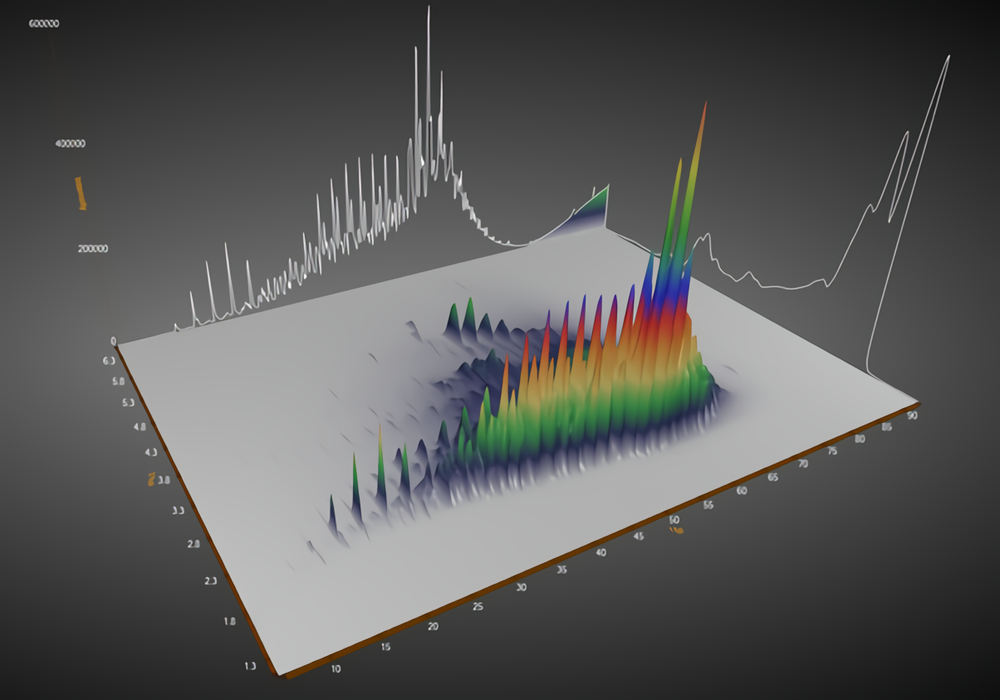

# Mesh 

Generate mesh data based on the ``MarchingSquares`` algorithm. A core graphics module for visualize the MS data like LCMS MS1 scans or Comprehensive Two-Dimensional Gas Chromatography(GCxGC) raw data. 

