# 功能注释与富集分析

## 获取UniProt功能注释数据

首先访问UniProt网站：https://uniprot.org/。然后选择**ID mapping**功能，进入批量数据获取初始界面：


从原始数据文件之中，找到``ID``列，ID列一般是UniProt蛋白编号，将这列的数据全部复制出来，然后粘贴进入输入框之中

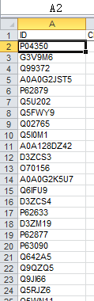

<div style="page-break-after: always;"></div>

选择``Uniprot ID``到``UniProtKB``的转换

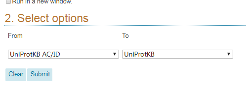

点击提交之后，在跳转之后的结果页面选择下载全部蛋白结果的``XML``数据，下载完成之后解压缩备用，完成注释数据的获取操作：

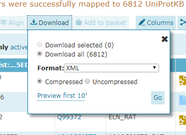

<div style="page-break-after: always;"></div>

## 总蛋白功能注释

### 生成注释表格

这一步骤需要使用具有``ID``蛋白编号列的原始数据表格，以及上一步所下载得到的Uniprot蛋白注释数据，使用如下命令完成总蛋白注释结果表格的生成：

```bash
# /uniprot 所下载得到的UniProt蛋白注释数据
# /list 具有蛋白编号列数据的原始样品数据表格，编号列必须使用ID表头命名或者处于第一列
eggHTS.exe /protein.annotations /uniprot "uniprot.XML" /accession.ID /iTraq /list "sample_data.csv"
```

所生成的总蛋白功能注释表格的表头说明：

| 表头     | 说明                          |
|----------|-------------------------------|
| ID       | 蛋白在原始数据表格之中的编号  |
| geneName | 对应的基因名称                |
| ORF      | 基因编码这个蛋白质的ORF的名称 |
| Entrez   | NCBI编号                      |
| fullName | 蛋白的全称                    |
| uniprot  | 蛋白在UniProt数据库之中的编号 |
| GO       | GO功能注释结果列表            |
| EC       | 酶分类信息                    |
| KO       | KEGG直系同源分析信息          |
| pfam     | 蛋白质二级结构信息            |
| organism | 物种来源                      |

<div style="page-break-after: always;"></div>

### 总蛋白GO统计分析

这一步需要基于上一步所生成的总蛋白注释表格以及结合``GO.obo``(http://geneontology.org/page/download-ontology)数据库来完成绘图操作：

```bash
# /in 上一步骤所生成的总蛋白注释表格
# /go 所下载的go.obo注释数据库
# /tick 坐标轴的标签间隔，-1表示使用默认间隔，也可以在这里自定义间隔值
# /level GO分类的等级，-1为默认值，表示不分类，可以按照需求自定义 ``1到10``等级进行统计分析
# /selects 在图表上进行展现的功能注释``term``的数量的选择，如果term太多了，图表显示不完整，可以将这个值调高
# /size 可以按照需求调整输出的图表的分辨率大小
eggHTS /proteins.Go.plot /in "uniprot-annotations.csv" /GO "go.obo" /tick -1 /level -1 /selects quantile:0.98 /size 2000,2200
```

产生的结果图应该是类似下图所示：

<center>
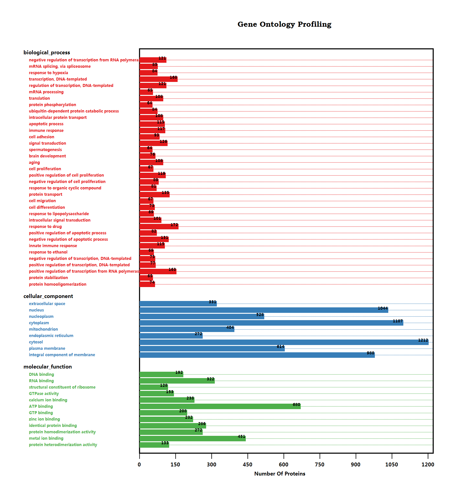
</center>

<div style="page-break-after: always;"></div>

### 总蛋白KEGG统计分析

这一步需要基于总蛋白注释表格以及结合KEGG同源数据库来完成绘图操作

+ KEGG的直系同源数据库可以在 http://www.kegg.jp/kegg-bin/download_htext?htext=%s00001&format=htext&filedir= 下载得到，在这里需要将上面的链接之中的%s替换为所分析的物种在KEGG数据库之中的简写代码
+ 物种简写代码可以在 http://www.kegg.jp/kegg/catalog/org_list.html 页面进行查找

```bash
# /in 总蛋白的功能注释结果表格
# /custom 自定义KO数据库，这个数据库一般可以从KEGG网站下载获取得到，也可以忽略这个参数使用通用数据库（一般不建议）
# /size 同Go注释作图参数
# /tick 同Go注释作图参数
eggHTS /proteins.KEGG.plot /in "uniprot-annotations.csv" /custom "sp00001.keg" /size "2200,2000" /tick -1
```

应该会生成如下所示的结果图：

<center>
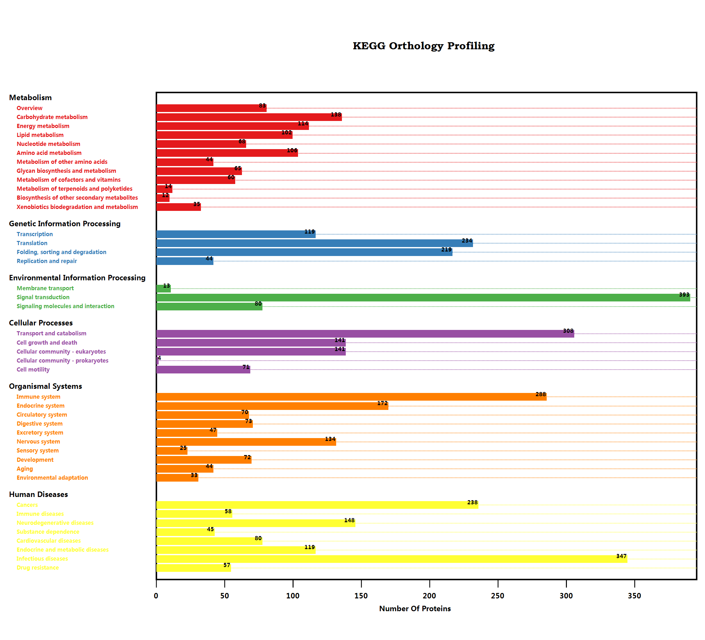
</center>

<div style="page-break-after: always;"></div>

## 差异蛋白功能富集注释

最终在完成了差异蛋白的计算分析以及总蛋白的注释数据的获取之后，就可以进行差异蛋白的富集计算分析了。进行差异蛋白的功能富集计算分析一般使用KOBAS在线系统完成，假若有时候KOBAS系统无法正常访问使用的时候可以选择DAVID系统作为备用

### KOBAS功能富集分析

访问网址：http://kobas.cbi.pku.edu.cn/anno_iden.php

KOBAS需要分别选择编号的类型，这里一般选择Uniprot编号，输入物种名称全称，以及输入差异蛋白的编号列表：

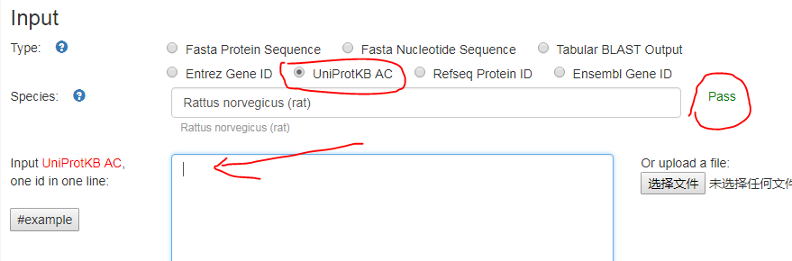

在最下方的数据库选择之中只选中KEGG和Go之后点击``run``按钮完成分析。

在结果界面点击``Download``按钮得到结果文件，下载备用。为了进行后续的GO和KEGG的功能富集分析，需要将结果文件转换为可以使用的csv文件格式，在这里使用命令来完成转换操作：

```bash
eggHTS /KOBAS.split /in "out_run.txt"
```

命令会生成两个csv表格文件

<div style="page-break-after: always;"></div>

### DAVID功能富集分析

当KOBAS系统无法访问的时候可以选择DAVID系统 (https://david.ncifcrf.gov/summary.jsp) 进行分析，DAVID系统的使用稍微复杂一些。

#### 1. 上传编号列表

按图中所示，分别输入基因编号列表，选择类型为Uniprot编号，并且为基因列表类型，点击上传按钮完成第一步：

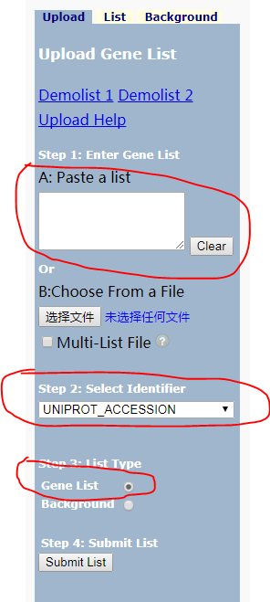

#### 2. 功能富集

假若上传成功，则会出现如下界面：

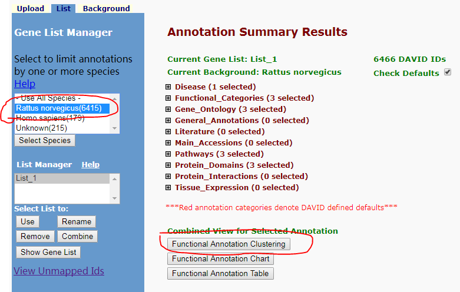

选择所需要分析的目标物种，然后进行功能聚类分析，在弹出的页面点击下载链接得到结果文件。

为了进行后续的Go和KEGG的功能富集分析，需要将结果文件转换为可以被使用csv文件格式，可以使用下面的命令来完成转换操作：

```bash
eggHTS /DAVID.Split /in "DAVID.txt"
```

<div style="page-break-after: always;"></div>

### GO富集分析绘图

在KOBAS的富集结果的基础上使用如下命令，可以生成与总蛋白的Go注释类似的条形图

```bash
# /in 进行富集分析得到的Go结果csv表格
# /displays 每一个namespace下最多显示的term的数量
# /pvalue 在绘图的时候所以的pvalue大于这个阈值参数的设定值的term都将不会被显示出来
# /size 调整图片大小
# /tick 调整横坐标轴的间隔
# /go Go注释数据库
eggHTS /Go.enrichment.plot /in "enrichmentTerm.csv" /displays 15 /pvalue 0.05 /size "2000,1600" /tick -1 /go "go.obo"
```

对于DAVID的富集结果，可以使用下面的命令完成作图分析：

```bash
# /in DAVID的富集结果
eggHTS /GO.enrichment.DAVID /in "GO_enrichment.csv" /go "go.obo" /size "1200,1000" /tick -1 /p.value 0.05
```

<div style="page-break-after: always;"></div>

### KEGG富集分析作图

在KOBAS的富集结果的基础之上，可以使用下面的命令来完成绘图：

```bash
eggHTS /KEGG.enrichment.plot /in "enrichmentTerm.csv" /pvalue 0.05 /tick -1 /size "2000,1600" 

# /DEPs 差异蛋白计算得到的结果
# /uniprot 在前面所下载得到的Uniprot蛋白功能注释数据库
eggHTS /KEGG.Enrichment.PathwayMap /in "enrichmentTerm.csv" /DEPs "deps.csv"  /uniprot "uniprot.XML" /pvalue 0.05
``` 

而对于DAVID的结果，则使用下面的命令作图

```bash
# /custom KO直系同源库
eggHTS /KEGG.enrichment.DAVID /in "david.csv" /custom "ko00001.keg" /size "1200,1000" /p.value 0.05 /tick -1

# /DEPs 同上
# /uniprot 同上
eggHTS /KEGG.enrichment.DAVID.pathwaymap /in "david.csv" /uniprot "uniprot.XML"  /DEPs "deps.csv" /pvalue 0.05
```

<div style="page-break-after: always;"></div>

### 差异蛋白string-DB网络图作图

访问 https://string-db.org/cgi/input.pl?sessionId=2M1I2tHWCtNx&input_page_active_form=multiple_identifiers 进行差异蛋白的编号列表输入，开始构建蛋白互作网络。

分别按照要求输入基因列表，以及物种的名称：

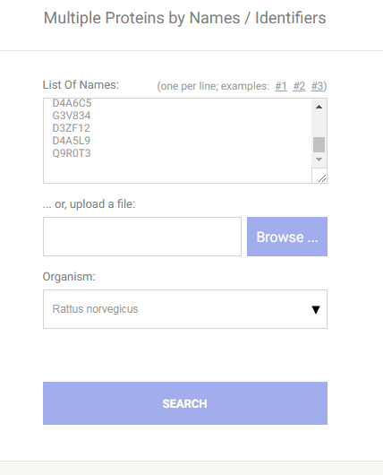

下一页如果不出问题的话，应该可以直接点击``Continute``进入结果页面。在结果页面之上，我们还需要进行一些设置才可以得到最终的网络图：

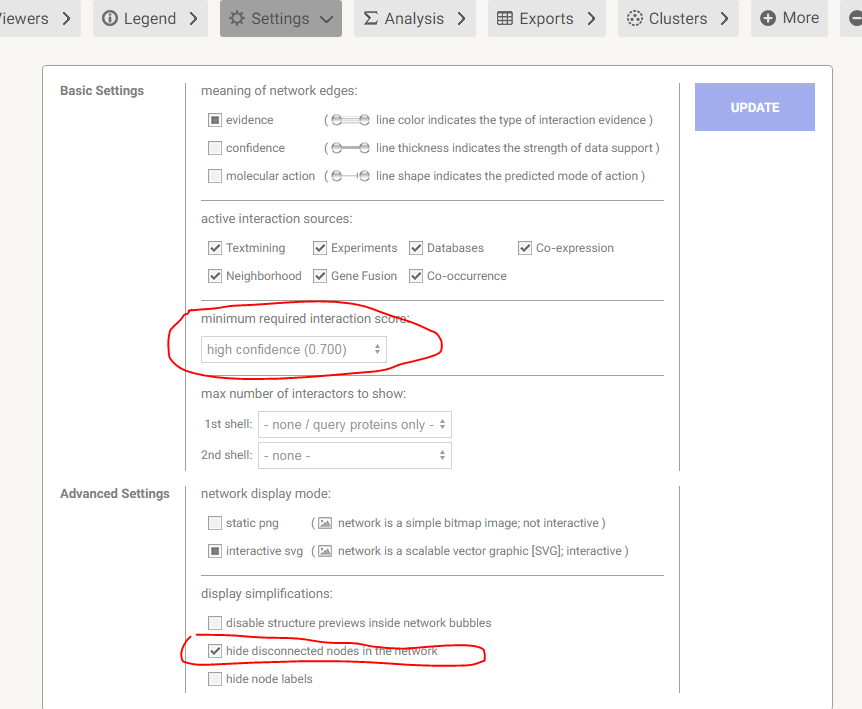

1. 如果蛋白的数量过多的话，会需要设置得分的阈值高一些，以减少蛋白的数量
2. 选中 ``hide disconnected nodes in the network``
3. ``UPDATE``更新结果网络图

最后，点击``EXPORT``进行结果文件的下载操作

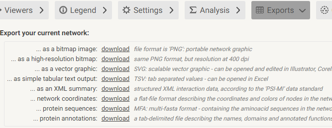


