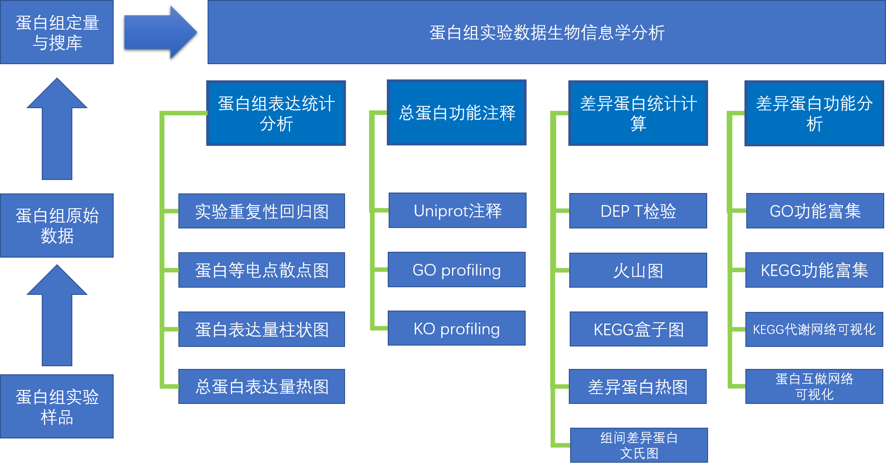

## 蛋白组分析方案

本蛋白组生物信息学数据分析报告主要由4大部分的数据分析内容构成：

1. 蛋白组表达统计分析
2. 总蛋白功能注释
3. 差异蛋白统计学分析
4. 差异蛋白功能分析

> 帕诺米克TM蛋白组数据生物信息学分析内容

#### 蛋白组表达统计分析

进行蛋白质组的总蛋白的表达统计分析，这有助于我们进行对蛋白组的表达情况的初步了解。在这部分的分析之中，我们一般会首先进行蛋白组的实验重复性的回归分析，通过回归结果来了解实验的重复一致性以及评估原始数据的数据质量。之后会对蛋白组总蛋白进行等电点的分析，绘制蛋白等电点散点图，按照实验比对组别挑选每一个组别之中表达量较高的前25个蛋白质绘制相对表达量的柱状图与饼图，以帮助蛋白组结果报告阅读人员对蛋白组的表达情况做一个初步的了解。

#### 总蛋白功能注释

对总蛋白的功能注释分析，主要是依靠蛋白组原始数据对``uniprotKB``数据库的搜库结果，通过``uniprotKB``数据库之中已经完成的高质量的蛋白注释数据来为所研究的目标蛋白组样品所获取的到的总蛋白进行功能注释分析。功能注释分析的结果主要是通过两部分的结果绘图可视化来呈现给数据分析报告的阅读人员：``GO profiling``和``KO profiling``。其中``GO profiling``是通过``uniprotKB``注释结果之中的``GO``功能注释结果进行统计分析，并绘制柱状图。而``KO profiling``则是对``KEGG Orthology``的注释的统计结果进行柱状图绘制可视化。

#### 差异蛋白统计学分析

差异蛋白统计学分析主要是为了了解哪些蛋白，有多少蛋白是由于实验设计而产生的调控作用而导致的蛋白的表达量在实验间产生了差异表达。在蛋白组的差异表达分析之中一般使用学生氏T检验来完成。因为蛋白组的表达一般需要经过转录，翻译这两个阶段，由于所受到的调控相较于转录而言，会更加多，故而蛋白组的变化剧烈程度并不会像转录组一样，故而所选取的``log2FC``阈值标准一般为``log2(1.5)``或者``log2(1.25)``，对于转录组而言，阈值标准一般为``log2(2)``或者``log2(4)``。在完成了学生氏T检验之中，除了``log2FC``的阈值筛选外，我们还会对检验的``p-value``以及``p-value``的``FDR``结果进行筛选，从而获取到最终的差异表达蛋白。最终通过火山图的绘制，我们可以清楚的了解到差异蛋白在组别内的表达量变化程度上的分布情况；通过热图绘制，我们可以清楚的了解到差异蛋白在组别间的表达量变化程度上面的分布情况；通过文氏图的绘制，可以让我们进行多个组别间的比较，了解组别间的共同点和各自的特点。``KEGG``盒子图则是对所计算得到的差异蛋白进行KEGG代谢通路的注释结果进行统计分析，了解哪个通路上面的变化最多。

#### 差异蛋白功能分析

差异蛋白功能分析则是在上一步所得到的差异蛋白结果的基础之上，通过功能富集分析，试图了解这些差异表达的蛋白质与哪些生物学功能的变化相关的，即有哪些生物学功能是由于实验设计而产生的调控作用而实实在在的发生了变化。将差异表达的蛋白质与具体的生物学功能进行关联主要是通过功能富集分析，而功能富集分析又主要是由``GO``富集分析以及``KEGG``富集分析所构成的。

在KEGG代谢网络可视化之中，我们还会将网络之中处于相同的代谢通路的蛋白质通过凸包算法为蛋白组报告的阅读人员标注出来，从而能够让报告的阅读人员更加清楚的了解